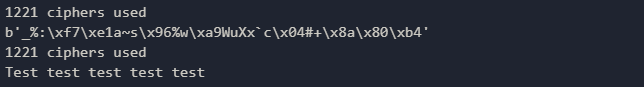

#  simple-symmetric-cipher
simple-symmetric-cipher is a simple module for symmetric encrypting using multiple [LSFR](https://en.wikipedia.org/wiki/Linear-feedback_shift_register).

## example
```py
content = "Test test test test test".encode('utf-8')
key = "foo123"
print(crypted := crypt(key, content, 500, 1500))
print(str(crypt(key, crypted, 500, 1500), 'utf-8'))
```

